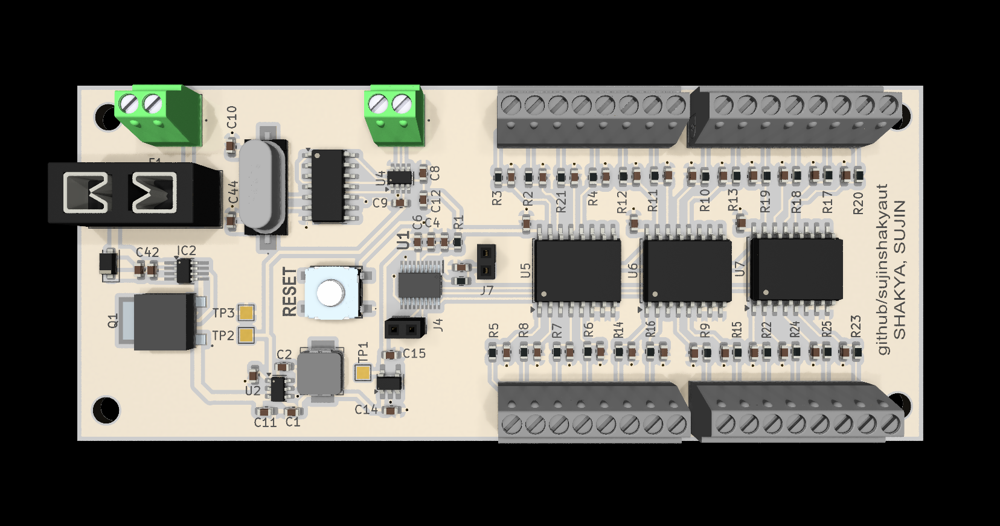

# Temperature Sensor Board

A compact multi-channel temperature sensing PCB built around the TI MSPM0C1104 microcontroller with CAN FD communication. Designed as a tap board that mounts directly onto the Orion BMS module, providing up to 8 analog temperature inputs multiplexed through a single ADC channel with robust power protection for automotive and industrial environments.

## Table of Contents

- [Background](#background)
- [Hardware](#hardware)
- [Features](#features)
- [Contributing](#contributing)
- [License](#license)

## Background

This is a redesigned temperature sensing board intended to mount as a tap board on the Orion BMS module, providing cell temperature monitoring across the battery pack. The board consolidates power regulation, input protection, analog multiplexing, and CAN FD communication onto a single compact PCB.

The CLV4051A 8:1 analog multiplexer allows a single ADC input on the MSPM0C to scan up to 8 temperature sensor channels sequentially, reducing pin count while maintaining measurement flexibility. The MCP2517FD provides CAN FD connectivity over SPI, enabling integration into modern automotive or industrial networks.

Power input is protected by an LM74500 ideal diode controller and an SMF24CA TVS diode, with the AP63205 buck converter stepping down to 5 V and a TPS7A03 LDO providing a clean 3.3 V rail for the microcontroller and analog circuitry.

## Hardware

| Component | Part | Description |
|-----------|------|-------------|
| MCU | MSPM0C1104SDGS20R | TI MSPM0C Arm Cortex-M0+ microcontroller |
| CAN FD | MCP2517FD-H/SL | Microchip CAN FD controller (SPI) |
| Analog Mux | CLV4051ATDWRG4Q1 | TI 8:1 analog multiplexer |
| Buck Converter | AP63205 | 2 A synchronous buck, input to 5 V |
| LDO | TPS7A03 | 3.3 V LDO for MCU and analog rails |
| Ideal Diode | LM74500QDDFRQ1 | Reverse polarity and ORing protection |
| MOSFET | SUD20N10-66L-GE3 | N-channel power switch |
| TVS | Littelfuse SMF24CA | 24 V bidirectional transient protection |
| Crystal | HC49/4HSMX | MCU clock source |
| Fuse | Keystone 3568 | Blade mini fuse holder |

## Features

- 8-channel analog temperature input via CLV4051A multiplexer
- CAN FD communication (MCP2517FD over SPI)
- Wide input voltage range with reverse polarity and TVS protection
- On-board buck + LDO two-stage power supply with 24V voltage regulation
- Screw terminal connectors.
- M3 mounting holes for panel or DIN mount

## Contributing

Open an issue or pull request on [GitHub](https://github.com/sujinshakyaut/temp_sense_e27).

## License

MIT
